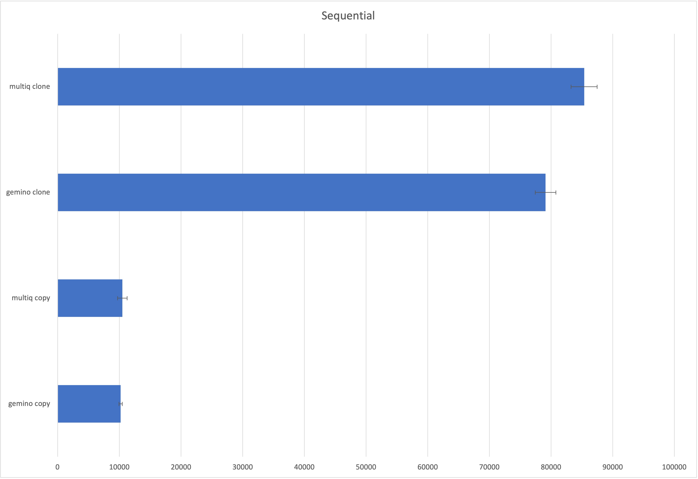
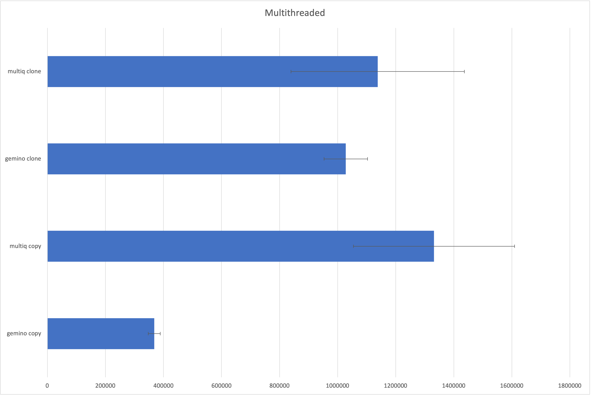
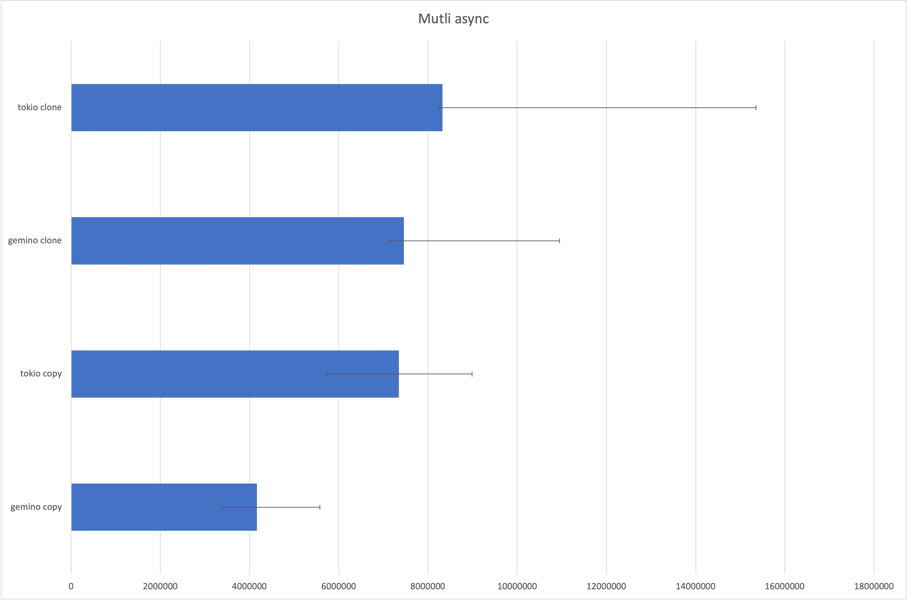

# Gemino

**A MPMC channel**

[![Crates.io][crates-badge]][crates-url]
[![Documentation][doc-badge]][doc-url]
[![MIT licensed][mit-badge]][mit-url]

[crates-badge]: https://img.shields.io/crates/v/gemino.svg

[crates-url]: https://crates.io/crates/gemino

[mit-badge]: https://img.shields.io/badge/license-MIT-blue.svg

[mit-url]: https://github.com/lochlanna/gemino/blob/main/LICENSE

[doc-badge]: https://docs.rs/gemino/badge.svg

[doc-url]: https://docs.rs/gemino

## What is Gemino

Gemino is an implementation of a multi producer multi consumer (MPMC) broadcasting channel where all receivers have the
opportunity to receive all messages sent by all producers. The library has been designed with speed and ease of use in
mind
and offers both a blocking and asynchronous API which can be used at the same time.

If the data being sent through the channel implements Copy there are some nice optimisations that are (automatically)
made which
make the channel significantly faster. When using Copy, no locks are required for reads or writes. It is possible to
detect a corrupt read after it's taken place eliminating the need for locks. This isn't the case with clone where
arbitrary code needs to be run that depends on the memory inside the channel. For this reason locks must be used
to ensure that writers do not overwrite a value that is being cloned. The overhead is high although the overall speed
of the channel is still very fast and with my very rudimentary benchmarks still considerably faster than other
broadcasting channel implementations.

Gemino was developed as a personal learning exercise, but I believe it is good enough to share and use.
> Gemino is still in very early development, is lacking rigorous testing and makes use of unsafe as well as unstable
> features. Use at your own risk!

## Unstable Features

Gemino makes use of the
unstable [`min_specialization`](https://doc.rust-lang.org/beta/unstable-book/language-features/min-specialization.html)
feature. This is the sound subset of the larger and
currently [`specialization`](https://rust-lang.github.io/rfcs/1210-impl-specialization.html) feature.
`min_specialization` is stable enough that it is in use within the standard library. That being said it's still an
unstable feature,
requires nightly.

## Why use Gemino?

* You need both async and blocking access to the same channel.
* You need multiple receivers and senders but are not concerned with data loss if a receiver falls behind.
* You need to be able to close the channel and have all parties be notified.

## Why not use Gemino?

* Unstable nightly only features are something you want to avoid.
* Gemino uses unsafe and may exhibit undefined behaviour that we haven't seen or found yet.
* If you need to absolutely guarantee that all receivers get all the messages without fail Gemino is not for you.

# Benchmarks
So far I've only written a couple of super basic benchmarks and I definitely need to do some more work to stress everything
more thoroughly/correctly.

Currently, I'm only comparing against [tokio::sync::broadcast](https://docs.rs/tokio/latest/tokio/sync/broadcast/index.html) and [multiqueue](https://github.com/schets/multiqueue).

Gemino is faster than Tokio implementation and slightly faster than multiqueue while being considerably more consistent than both.
Being more consistent means that geminos latency should be more predictable than the other two.

| **Single threaded**           | ns/iter | +-      |         |
|-------------------------------|---------|---------|---------|
| gemino copy                   | 10211   | 283     |         |
| multiq copy                   | 10496   | 770     |         |
| gemino clone                  | 79118   | 1671    |         |
| multiq clone                  | 85375   | 2114    |         |
| **4 readers 4 writers**       |         |         |         |
| gemino copy                   | 368411  | 20533   |         |
| multiq copy                   | 1331904 | 277678  |         |
| gemino clone                  | 1028063 | 75103   |         |
| multiq clone                  | 1137864 | 298458  |         |
| **4 readers 4 writers async** |         |         |         |
|                               |         | +       | -       |
| gemino copy                   | 4164023 | 1413060 | 780273  |
| tokio copy                    | 7347818 | 1639432 | 1613110 |
| gemino clone                  | 7459048 | 3486077 | 326673  |
| tokio clone                   | 8323468 | 7026741 | 80843   |

### Single thread sequential

### Four write threads + four read threads

### Four write threads + four read threads + async
